# Imagenología · UGM — Control de asistencia de pacientes

**Nuevo Hospital Rosales · Red Nacional de Hospitales**

Plataforma web (Google Apps Script + Google Sheets + Firebase Realtime Database) para llevar el control de los pacientes que vienen a sus estudios de imagenología:

- **Técnicos** (iPads): ven la agenda del día por tarjetas y marcan *Asistió* / *No asistió* (con motivo y comentario). Todo se sincroniza al instante entre dispositivos.
- **Supervisores**: radar en vivo con gráficas, agenda completa, línea de tiempo, **reportes** (asistieron / no asistieron / motivos) en Excel, PDF o CSV, carga del Excel del hospital y cierre de turno.

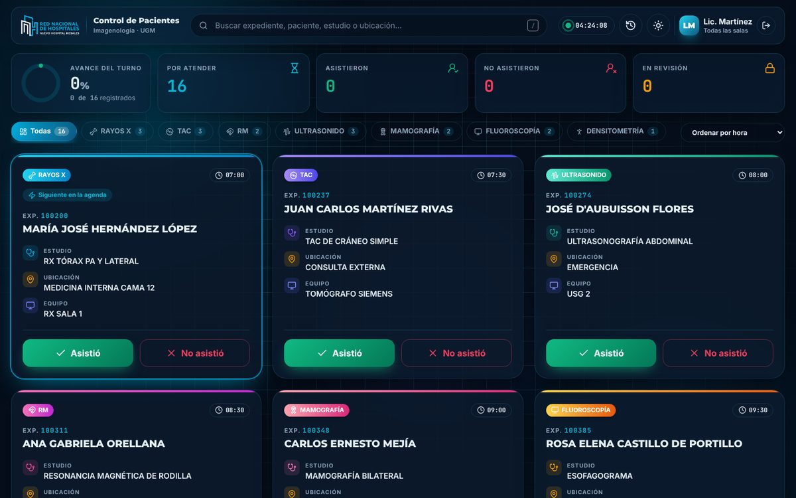

---

## Índice

1. [Análisis del sistema anterior](#1-análisis-del-sistema-anterior)
2. [Qué se mejoró](#2-qué-se-mejoró)
3. [Estructura del proyecto](#3-estructura-del-proyecto)
4. [Instalación paso a paso](#4-instalación-paso-a-paso)
5. [Uso diario](#5-uso-diario)
6. [El Excel del hospital](#6-el-excel-del-hospital)
7. [Reportes](#7-reportes)
8. [Seguridad (importante)](#8-seguridad-importante)
9. [Personalización](#9-personalización)
10. [Capturas](#10-capturas)

---

## 1. Análisis del sistema anterior

El sistema original (Código.gs, Admin.html, Tecnico.html, Supervisor.html) funcionaba, pero tenía estos problemas:

| # | Problema | Consecuencia |
|---|----------|--------------|
| 1 | Firebase usaba el **número de expediente como clave** | Si un paciente tenía **dos estudios el mismo día** (p. ej. RX y USG), al marcar uno se marcaba también el otro. "Restaurar" solo restauraba la primera fila. |
| 2 | La hoja se actualizaba por **número de fila** | Frágil: si la hoja se reordenaba o se limpiaba, se podía escribir en el paciente equivocado. |
| 3 | Nombres insertados directamente en `onclick="...'${p.paciente}'..."` | Un apellido con apóstrofo (D'AUBUISSON) **rompía el botón**. Además permitía inyectar HTML (XSS). |
| 4 | Bloqueo "Revisando" sin liberación | Si el iPad se cerraba con el modal abierto, el paciente quedaba **bloqueado para siempre**. |
| 5 | Dos técnicos podían marcar al mismo paciente a la vez | El último en llegar **sobrescribía** al primero. |
| 6 | Nombres de técnico con `.`, `#`, `$`, `[`, `]` (ej. "Lic. Pérez") | **Error de Firebase**: esos caracteres no se permiten en las claves. |
| 7 | `Admin.html` nunca se mostraba | `doGet` solo servía Técnico y Supervisor: era código muerto. |
| 8 | Columnas del Excel **fijas** (desde la fila 6, columnas B–G) | Si el hospital cambiaba el formato del Excel, la carga se rompía en silencio. No se usaba el **tipo de equipo**. |
| 9 | Se podía cargar el mismo Excel dos veces | **Pacientes duplicados**. |
| 10 | El reporte no tenía los **motivos de inasistencia** ni la lista de quiénes no vinieron | Justo lo que más se necesitaba. |
| 11 | Cada cierre de turno creaba una **hoja nueva** "Historial_fecha" | El archivo crecía sin control y no había forma de sacar reportes por rango de fechas. |
| 12 | Cálculos del supervisor solo con lo registrado en Firebase | No se conocía el total de la agenda ni los pendientes reales. |

## 2. Qué se mejoró

**Funcionalidad**

- ✅ **ID único por cita** (no por expediente): un paciente puede tener varios estudios el mismo día.
- ✅ **Transacciones en Firebase**: si dos técnicos tocan al mismo paciente, gana el primero y el otro recibe un aviso. El backend también verifica conflictos con `LockService`.
- ✅ **Bloqueo inteligente**: al abrir "No asistió", la tarjeta se bloquea para los demás ("Lic. Gómez está registrando"). Si se cae la conexión del iPad, **se libera automáticamente**. El supervisor puede liberar bloqueos atascados con un clic.
- ✅ **Motivos de inasistencia** con icono (10 motivos, incluido "Falla o mantenimiento del equipo" y "Contraindicación médica") **+ comentario** (obligatorio si el motivo es "Otro").
- ✅ **Deshacer**: el técnico puede deshacer un registro desde el aviso o desde "Mis registros".
- ✅ **Filtro por sala/equipo**: cada técnico elige su modalidad (RX, TAC, RM, USG, Mamografía, Fluoroscopía, Densitometría, Intervencionismo).
- ✅ **Detección automática de la modalidad** a partir del equipo y del nombre del estudio.
- ✅ **Carga del Excel con vista previa**: se detectan las columnas por su encabezado (con respaldo al formato antiguo), se pueden ajustar a mano y se **omiten los duplicados**.
- ✅ **Historial único** (hoja "Historial") con la fecha de cierre, para sacar **reportes por rango de fechas**.
- ✅ **Códigos de acceso**: los técnicos ya no escriben su nombre; entran con un **código que el supervisor les asigna** (sección *Accesos*). El panel de supervisores también pide código. El servidor valida el código en cada acción, pone el nombre del técnico (nadie puede hacerse pasar por otro) y, si se desactiva un código, esa persona sale al instante. Al recargar la página siempre se vuelve a pedir el código.
- ✅ **Botón "Generar reporte"** siempre visible para el supervisor → vista previa + **Excel** (4 hojas con gráficos), **PDF/impresión** (con logos y firmas) y **CSV**.

**Diseño**

- 🎨 Identidad del **Nuevo Hospital Rosales**: logo, escudo y colores (cian `#00B2E3`, azul `#10567F`).
- ✨ **GSAP** en todo: intro con el logo, entrada de tarjetas en 3D, reordenamiento animado (Flip), contadores animados, explosión de partículas al marcar asistencia, anillos de progreso, modales con rebote, cajón lateral, avisos deslizantes, fondo con auroras y **línea de escaneo tipo radiografía**.
- 🧩 Iconografía **Lucide** (más de 50 íconos) con un icono y color propio por modalidad.
- 🌗 **Modo oscuro / claro** (se recuerda por dispositivo).
- 📱 Adaptado a **iPad, celular y escritorio**.
- ⚡ Optimizado para iPads: las tarjetas no usan desenfoque de fondo (`backdrop-filter`) para mantener la fluidez.

## 3. Estructura del proyecto

```
apps-script/          ← Archivos que van en el editor de Apps Script
  Codigo.gs           Backend: hojas, carga, registro, cierre, reportes Excel
  Tecnico.html        Vista de técnicos (iPads)
  Supervisor.html     Vista de supervisores (radar, agenda, reportes, admin)
  Cabecera.html       Librerías (Tailwind, Firebase, GSAP, Lucide) y fuentes
  Estilos.html        Estilos compartidos (vidrio, botones, animaciones)
  Comun.html          JavaScript compartido (Firebase, modalidades, motivos, animaciones)
  Intro.html          Pantalla de bienvenida con el logo
  Fondo.html          Fondo animado
  LogoHospital.html, LogoHospitalBlanco.html, Escudo.html, EscudoBlanco.html
                      Logos en base64 (no dependen de enlaces externos)
  appsscript.json     Manifiesto (zona horaria America/El_Salvador, V8)
firebase/
  database.rules.json Reglas sugeridas para Firebase (ver Seguridad)
assets/               Logos en PNG (original, a color y en blanco)
docs/capturas/        Capturas de pantalla
```

## 4. Instalación paso a paso

> ⚠️ **Antes de actualizar:** haz el **cierre de turno** con el sistema viejo. La nueva versión usa otro formato de hoja; si encuentra la hoja `Asistencia_Diaria` con el formato anterior, **la renombra** a `Asistencia_Diaria_ANTIGUA_<fecha>` (no se borra nada) y crea una nueva. Después de instalar, borra en Firebase los nodos `pacientes_hoy` y `logs` viejos (o haz un cierre de turno desde el nuevo panel).

1. Abre la hoja de cálculo de Google que usan hoy → **Extensiones → Apps Script**.
2. En el editor, para **cada archivo** de la carpeta `apps-script/`:
   - Si ya existe (Codigo.gs, Tecnico.html, Supervisor.html), **reemplaza todo su contenido**.
   - Si no existe, créalo con **＋ → HTML** y el **mismo nombre** (sin `.html`, Apps Script lo agrega solo): `Cabecera`, `Estilos`, `Comun`, `Intro`, `Fondo`, `LogoHospital`, `LogoHospitalBlanco`, `Escudo`, `EscudoBlanco`.
   - Los archivos de logos son una sola línea muy larga (la imagen en base64): cópiala completa.
3. Borra el archivo `Admin.html` (ya no se usa; la carga está en el panel del supervisor).
4. (Opcional) **Configuración del proyecto → Mostrar el archivo de manifiesto** y pega `appsscript.json`.
5. Ya **no se necesita** el servicio avanzado *Drive API* (el Excel ahora se lee en el navegador). Puedes quitarlo.
6. **Implementar → Administrar implementaciones → ✏️ Editar → Versión: Nueva versión → Implementar.** Así la URL sigue siendo la misma.
7. La primera vez Google pedirá **autorizar** permisos nuevos (Drive, para guardar los reportes en la carpeta *"Reportes Imagenología UGM"*).
8. Abre el link de **supervisores**: como aún no hay ningún supervisor, aparece **Configuración inicial** para crear tu nombre y tu código. Luego, en **Accesos**, asigna un código a cada técnico.

**Enlaces**

- Técnicos: `https://script.google.com/.../exec`
- Supervisores: `https://script.google.com/.../exec?vista=supervisor`

> La dirección de Firebase está en `Comun.html` (`FIREBASE_CONFIG`). Si cambian de proyecto de Firebase, solo se cambia ahí.

## 5. Uso diario

0. **Accesos (una sola vez por persona)**: Supervisor → **Accesos** → escribe un código (o pulsa **Generar**) → **Siguiente** → nombre del técnico y tipo de acceso → **Asignar código**. Entrégale el código al técnico. Desde la misma lista puedes ver, desactivar, reactivar o eliminar códigos. Los códigos se guardan en la hoja privada **Accesos**.
1. **Supervisor → Administración → Cargar agenda del día**: arrastra el Excel. Revisa la vista previa (pacientes detectados y modalidades) y pulsa **Cargar**. Los iPads se actualizan solos.
2. **Técnicos**: escriben su **código**, eligen su sala (opcional) y marcan cada paciente:
   - **Asistió** → un toque.
   - **No asistió** → eligen el motivo y, si quieren, un comentario.
   - ¿Se equivocaron? **Deshacer** en el aviso o en *Mis registros* (icono del reloj).
3. **Supervisor → Panel en vivo**: KPIs, estado de la agenda, asistencia por modalidad, flujo por hora, motivos de inasistencia, productividad por técnico y últimos movimientos, todo en tiempo real.
4. Al final del turno: **Generar reporte** → descargar Excel / imprimir PDF.
5. **Administración → Cerrar turno**: archiva todo en la hoja *Historial* y limpia las pantallas.

## 6. El Excel del hospital

La carga busca en las primeras 25 filas una fila de encabezados que contenga **"Expediente"** y reconoce estas columnas por su nombre:

| Campo | Encabezados que reconoce |
|-------|--------------------------|
| Expediente | expediente, exp, registro, historia clínica |
| Paciente | paciente, nombre |
| Estudio | estudio, examen, procedimiento, prestación, descripción |
| Equipo / sala | equipo, modalidad, sala, recurso, agenda, máquina |
| Ubicación | ubicación, servicio, cama, procedencia, área, origen |
| Fecha / Hora | fecha, hora (si la hora viene junto a la fecha, se separa sola) |
| Médico | médico, solicitante, doctor, referente |

Si no encuentra encabezados, usa el **formato antiguo** (datos desde la fila 6: B = expediente, C = paciente, D = ubicación, E = estudio, G = hora). En la vista previa, **"Ajustar columnas detectadas"** permite corregir cualquier columna a mano.

## 7. Reportes

Desde **Generar reporte** (arriba a la derecha) o el menú **Reportes**:

- **Origen**: *Turno actual* (en vivo) o *Historial* (rango de fechas, por fecha de cierre de turno).
- **Filtro por modalidad** y **"Elaborado por"**.
- Vista previa con KPIs, **motivos de inasistencia** (con porcentajes), tabla **por modalidad** y listas de *No asistieron* (con motivo y comentario), *Asistieron* y *Pendientes*.
- **Descargar Excel**: crea un archivo en Drive (carpeta *Reportes Imagenología UGM*) con las hojas **Resumen** (indicadores, tablas y 2 gráficos), **Asistieron**, **No asistieron** y **Pendientes**.
- **Imprimir / PDF**: documento tamaño carta con logos, indicadores, tablas y espacio para firmas (en el diálogo de impresión elige *Guardar como PDF*). Si no abre, permite las ventanas emergentes para el sitio.
- **CSV**: para abrir en cualquier programa.

## 8. Seguridad (importante)

**Lo que ya está protegido:** para entrar a cualquiera de las dos vistas se necesita un código válido. El servidor de Apps Script verifica el código (la sesión) en cada acción: cargar agenda, registrar pacientes, reportes, cierre de turno y gestión de códigos (estas últimas solo con código de supervisor). La sesión vive solo en memoria (al recargar se pide de nuevo), dura 6 horas y se renueva con cada uso. Equivocarse de código tiene una espera de ~1 s para dificultar que alguien los adivine; usa códigos de **6 o más** caracteres.

**Lo que falta:** la base de Firebase **no tiene autenticación**: cualquiera que conozca la URL puede leer y escribir. Como allí viajan **nombres y expedientes de pacientes**, se recomienda:

1. En la consola de Firebase → *Realtime Database → Reglas*, publicar `firebase/database.rules.json`. Bloquea todo lo que no sea parte del sistema y valida los estados. **No sustituye a un inicio de sesión**, pero reduce el riesgo.
2. Lo ideal (siguiente fase): activar **Firebase Authentication** (por ejemplo, inicio de sesión anónimo con dominio restringido o cuentas institucionales) y exigir `auth != null` en las reglas.
3. En la implementación de Apps Script, limitar **"Quién tiene acceso"** a las cuentas de la institución si es posible.

## 9. Personalización

Todo está en `Comun.html`:

- **Motivos de inasistencia** → arreglo `MOTIVOS` (texto + icono de [lucide.dev](https://lucide.dev/icons)).
- **Modalidades** → objeto `MODALIDADES` (icono, color y degradado). Las reglas de detección están en `detectarModalidad_` (Codigo.gs) y `detectarModalidad` (Supervisor.html).
- **Colores de marca** → `Cabecera.html` (`rosales`) y variables `--cian` / `--azul` en `Estilos.html`.

## 10. Capturas

| Técnico | Supervisor |
|---|---|
|  | 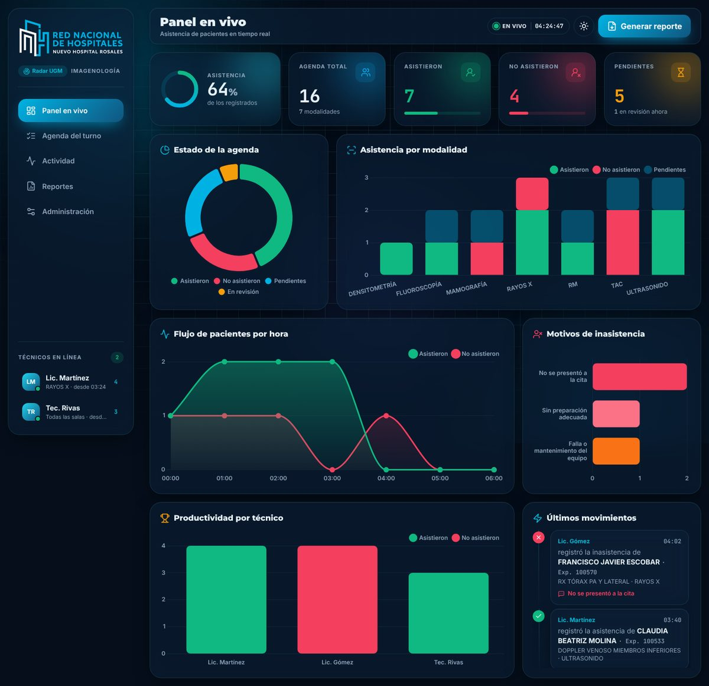 |
| 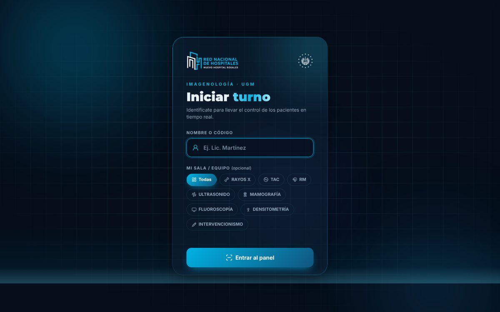 | 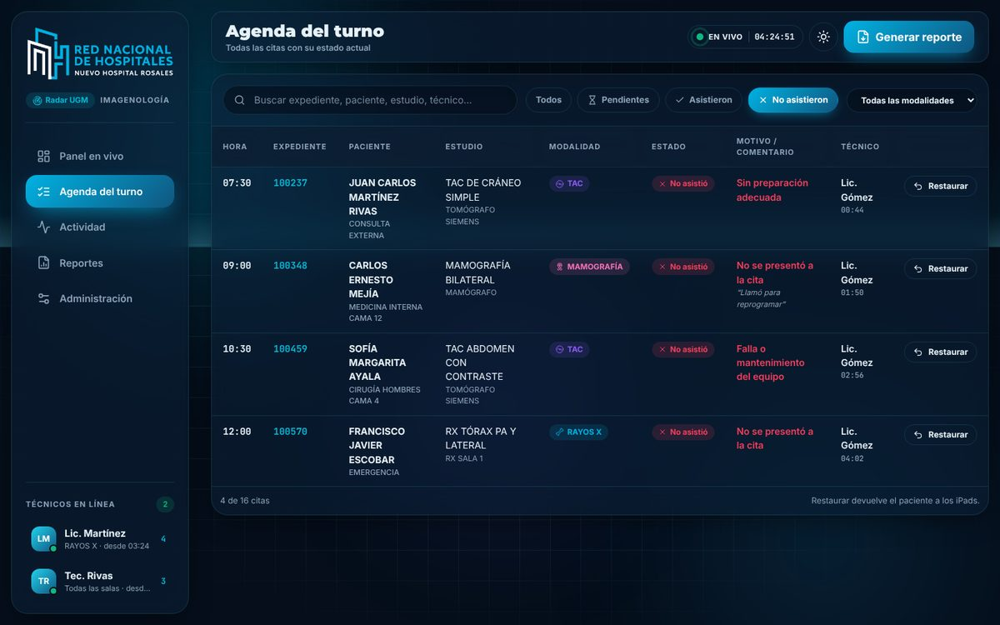 |
| 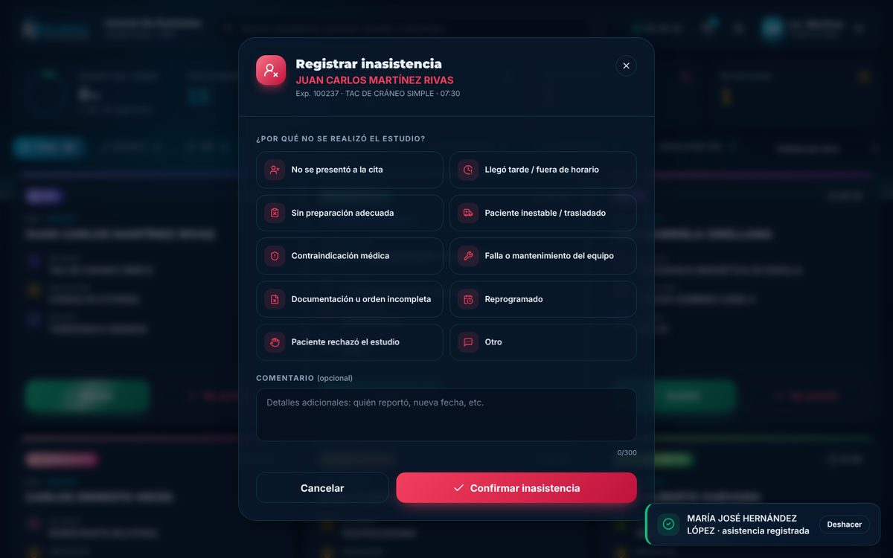 | 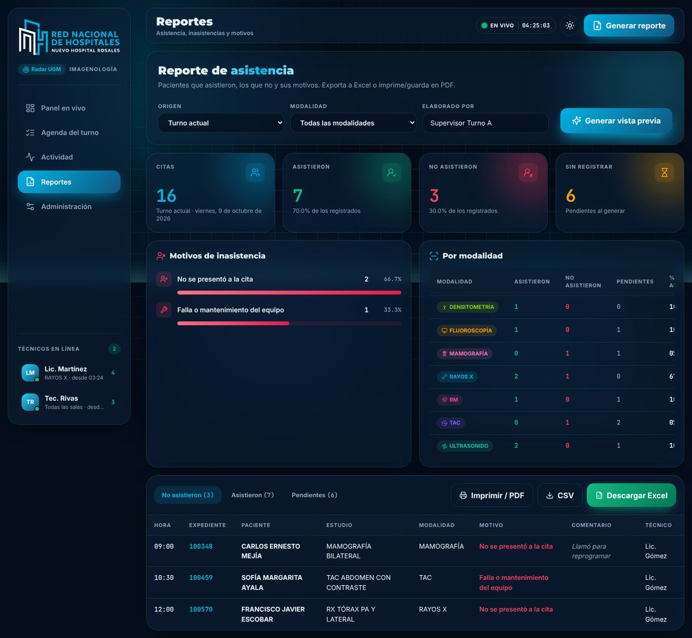 |
| 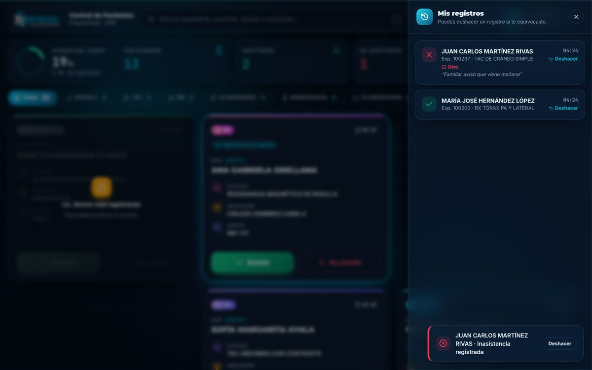 | 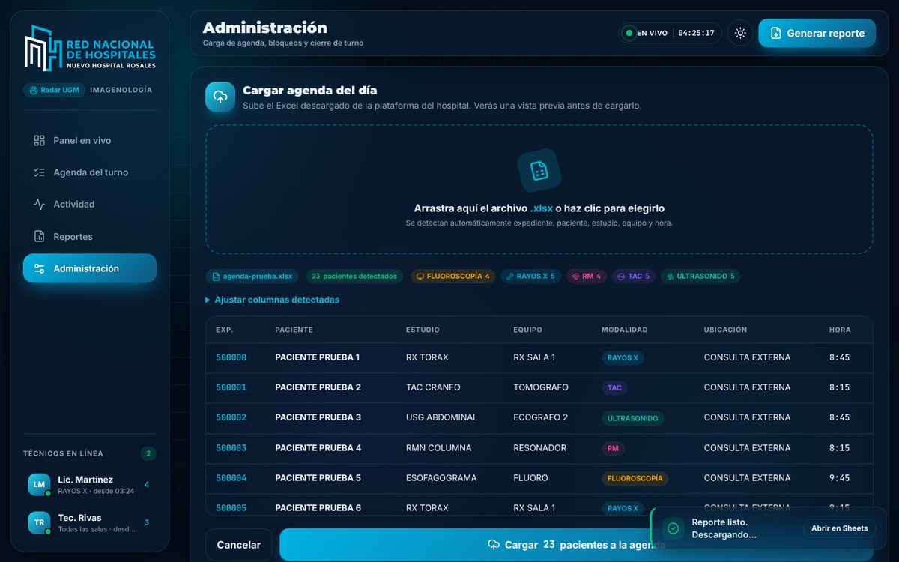 |
| 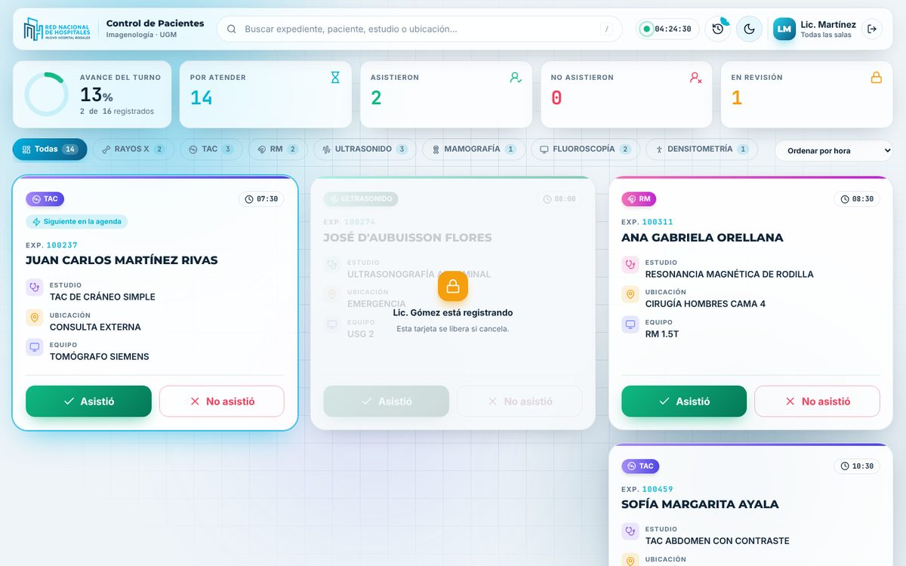 | 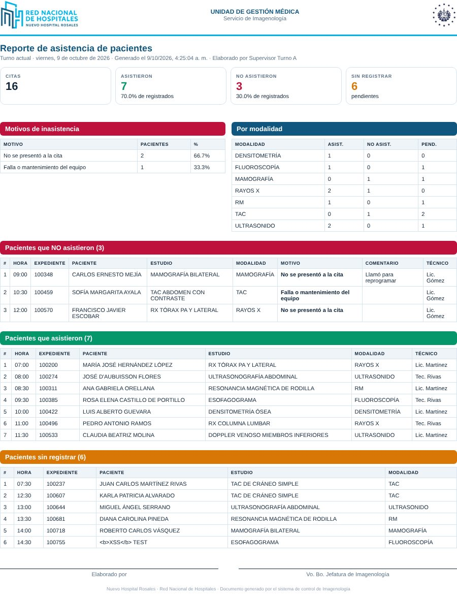 |
| 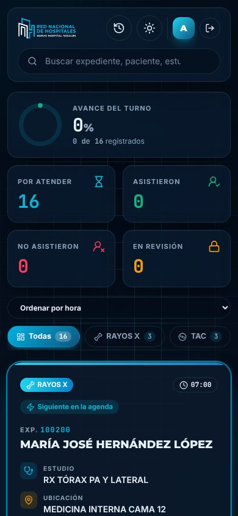 | |
